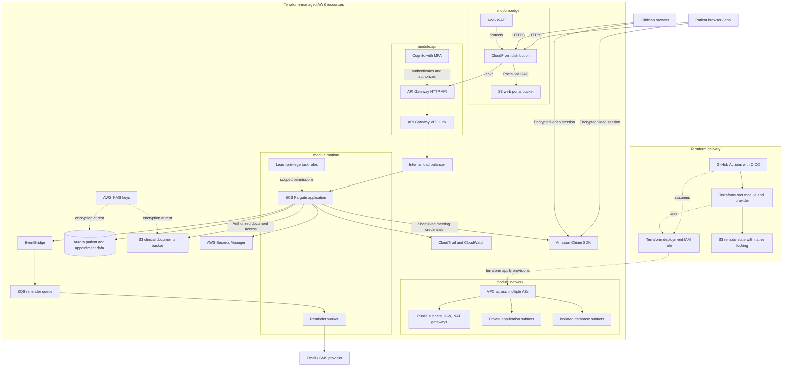

```mermaid
flowchart TB
    Patient[Patient browser / app]
    Clinician[Clinician browser]

    subgraph IaC[Terraform delivery]
        CI[GitHub Actions with OIDC]
        TF[Terraform root module and provider]
        Role[Terraform deployment IAM role]
        State[S3 remote state with native locking]
        CI --> TF
        CI -. assumes .-> Role
        TF --> State
        TF -. uses .-> Role
    end

    subgraph AWS[Terraform-managed AWS resources]
        subgraph Edge[module.edge]
            WAF[AWS WAF]
            CDN[CloudFront distribution]
            Web[S3 web portal bucket]
        end
        subgraph ApiModule[module.api]
            API[API Gateway HTTP API]
            Identity[Cognito with MFA]
            Link[API Gateway VPC Link]
        end
        subgraph Network[module.network]
            VPC[VPC across multiple AZs]
            Public[Public subnets, IGW, NAT gateways]
            Private[Private application subnets]
            Data[Isolated database subnets]
            VPC --> Public
            VPC --> Private
            VPC --> Data
        end
        InternalLB[Internal load balancer]
        subgraph Runtime[module.runtime]
            App[ECS Fargate application]
            Worker[Reminder worker]
            TaskRoles[Least-privilege task roles]
        end
        Records[(Aurora patient and appointment data)]
        Documents[S3 clinical documents bucket]
        Secrets[AWS Secrets Manager]
        Events[EventBridge]
        Queue[SQS reminder queue]
        KMS[AWS KMS keys]
        Audit[CloudTrail and CloudWatch]
        Video[Amazon Chime SDK]
    end

    Notify[Email / SMS provider]

    Patient -->|HTTPS| CDN
    Clinician -->|HTTPS| CDN
    WAF -. protects .-> CDN
    CDN -->|Portal via OAC| Web
    CDN -->|/api/*| API
    Identity -. authenticates and authorizes .-> API
    API --> Link --> InternalLB --> App
    App --> Records
    App -->|Authorized document access| Documents
    App -->|Short-lived meeting credentials| Video
    Patient -->|Encrypted video session| Video
    Clinician -->|Encrypted video session| Video
    App --> Events
    Events --> Queue --> Worker --> Notify
    App --> Secrets
    KMS -. encryption at rest .-> Records
    KMS -. encryption at rest .-> Documents
    TaskRoles -. scoped permissions .-> App
    App --> Audit
    Role -. terraform apply provisions .-> VPC


```
