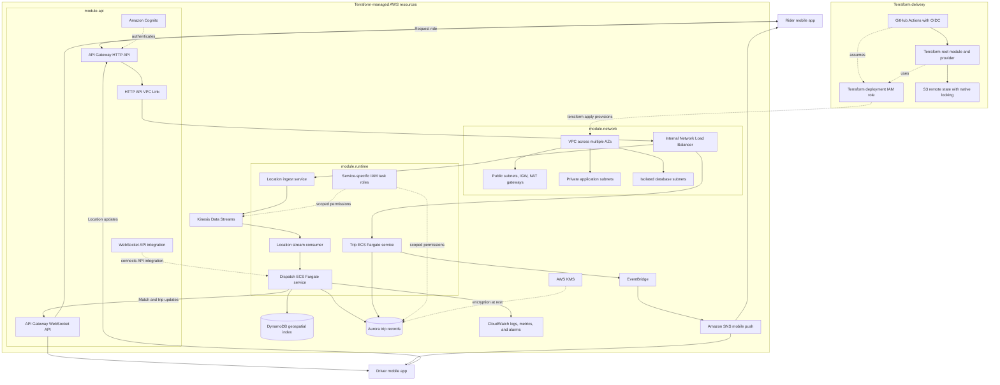

```mermaid
flowchart TB
    Rider[Rider mobile app]
    Driver[Driver mobile app]

    subgraph IaC[Terraform delivery]
        CI[GitHub Actions with OIDC]
        TF[Terraform root module and provider]
        Role[Terraform deployment IAM role]
        State[S3 remote state with native locking]
        CI --> TF
        CI -. assumes .-> Role
        TF --> State
        TF -. uses .-> Role
    end

    subgraph AWS[Terraform-managed AWS resources]
        subgraph ApiModule[module.api]
            Edge[API Gateway HTTP API]
            Realtime[API Gateway WebSocket API]
            Identity[Amazon Cognito]
            HttpLink[HTTP API VPC Link]
            WsLink[WebSocket API integration]
        end
        subgraph Network[module.network]
            VPC[VPC across multiple AZs]
            Public[Public subnets, IGW, NAT gateways]
            Private[Private application subnets]
            Isolated[Isolated database subnets]
            NLB[Internal Network Load Balancer]
            VPC --> Public
            VPC --> Private
            VPC --> Isolated
        end
        subgraph Runtime[module.runtime]
            Trip[Trip ECS Fargate service]
            Location[Location ingest service]
            Dispatch[Dispatch ECS Fargate service]
            LocationWorker[Location stream consumer]
            TaskRoles[Service-specific IAM task roles]
        end
        Stream[Kinesis Data Streams]
        GeoIndex[(DynamoDB geospatial index)]
        TripDB[(Aurora trip records)]
        Events[EventBridge]
        Push[Amazon SNS mobile push]
        KMS[AWS KMS]
        Monitor[CloudWatch logs, metrics, and alarms]
    end

    Rider -->|Request ride| Edge
    Driver -->|Location updates| Edge
    Identity -. authenticates .-> Edge
    Edge --> HttpLink --> NLB
    NLB --> Trip
    NLB --> Location
    Location --> Stream
    Stream --> LocationWorker --> Dispatch
    Dispatch --> GeoIndex
    Dispatch --> TripDB
    Dispatch -->|Match and trip updates| Realtime
    Realtime --> Rider
    Realtime --> Driver
    Trip --> TripDB
    Trip --> Events
    Events --> Push
    Push --> Rider
    Push --> Driver
    WsLink -. connects API integration .-> Dispatch
    TaskRoles -. scoped permissions .-> Stream
    TaskRoles -. scoped permissions .-> TripDB
    KMS -. encryption at rest .-> TripDB
    Dispatch --> Monitor
    Role -. terraform apply provisions .-> VPC

```
