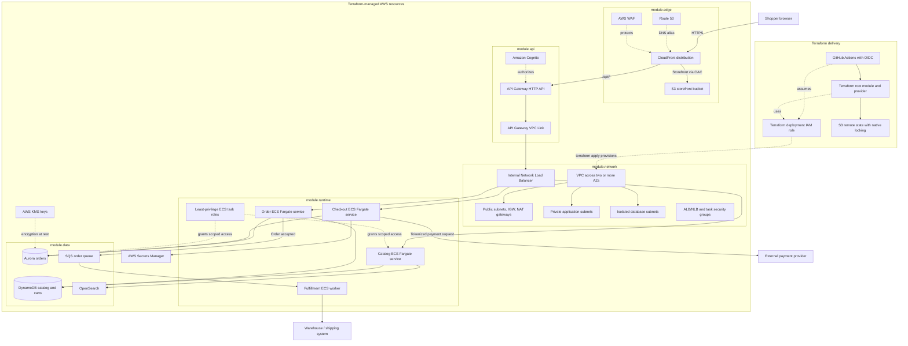

```mermaid
flowchart TB
    Shopper[Shopper browser]

    subgraph IaC[Terraform delivery]
        CI[GitHub Actions with OIDC]
        TF[Terraform root module and provider]
        Role[Terraform deployment IAM role]
        State[S3 remote state with native locking]
        CI --> TF
        CI -. assumes .-> Role
        TF --> State
        TF -. uses .-> Role
    end

    subgraph AWS[Terraform-managed AWS resources]
        subgraph Edge[module.edge]
            DNS[Route 53]
            WAF[AWS WAF]
            CDN[CloudFront distribution]
            Web[S3 storefront bucket]
        end
        subgraph ApiModule[module.api]
            API[API Gateway HTTP API]
            Identity[Amazon Cognito]
            VPCLink[API Gateway VPC Link]
        end
        subgraph Network[module.network]
            VPC[VPC across two or more AZs]
            Public[Public subnets, IGW, NAT gateways]
            Private[Private application subnets]
            Data[Isolated database subnets]
            NLB[Internal Network Load Balancer]
            SG[ALB/NLB and task security groups]
            VPC --> Public
            VPC --> Private
            VPC --> Data
        end
        subgraph Runtime[module.runtime]
            Catalog[Catalog ECS Fargate service]
            Orders[Order ECS Fargate service]
            Checkout[Checkout ECS Fargate service]
            Fulfillment[Fulfillment ECS worker]
            TaskRoles[Least-privilege ECS task roles]
        end
        subgraph DataModule[module.data]
            CatalogDB[(DynamoDB catalog and carts)]
            OrderDB[(Aurora orders)]
            Search[OpenSearch]
            Queue[SQS order queue]
        end
        KMS[AWS KMS keys]
        Secrets[AWS Secrets Manager]
    end

    Payments[External payment provider]
    Warehouse[Warehouse / shipping system]

    Shopper -->|HTTPS| CDN
    DNS -. DNS alias .-> CDN
    WAF -. protects .-> CDN
    CDN -->|Storefront via OAC| Web
    CDN -->|/api/*| API
    Identity -. authorizes .-> API
    API --> VPCLink --> NLB
    NLB --> Catalog
    NLB --> Orders
    NLB --> Checkout
    Catalog --> CatalogDB
    Catalog --> Search
    Orders --> CatalogDB
    Orders --> OrderDB
    Checkout -->|Tokenized payment request| Payments
    Checkout --> OrderDB
    Orders -->|Order accepted| Queue
    Queue --> Fulfillment
    Fulfillment --> Warehouse
    TaskRoles -. grants scoped access .-> Catalog
    TaskRoles -. grants scoped access .-> OrderDB
    KMS -. encryption at rest .-> OrderDB
    Checkout --> Secrets
    Role -. terraform apply provisions .-> VPC

```
