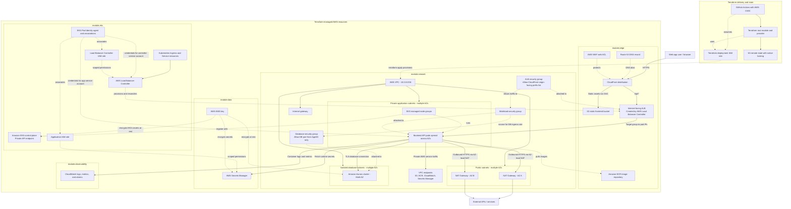

```mermaid

flowchart TB
    User[Web app user / browser]
    External[External APIs / services]

    subgraph IaC[Terraform delivery and state]
        CI[GitHub Actions with AWS OIDC]
        TF[Terraform root module and provider]
        DeployRole[Terraform deployment IAM role]
        State[S3 remote state with native locking]
        CI --> TF
        CI -. assumes .-> DeployRole
        TF --> State
        TF -. uses .-> DeployRole
    end

    subgraph AWS[Terraform-managed AWS resources]
        subgraph Edge[module.edge]
            Route53[Route 53 DNS record]
            WAF[AWS WAF web ACL]
            CloudFront[CloudFront distribution]
            Frontend[S3 static frontend bucket]
            ALB[Internet-facing ALB<br/>Created by AWS Load Balancer Controller]
            ECR[Amazon ECR image repository]
        end

        subgraph Network[module.network]
            VPC[AWS VPC - 10.0.0.0/16]
            IGW[Internet gateway]
            subgraph Public[Public subnets - multiple AZs]
                NAT_A[NAT Gateway - AZ A]
                NAT_B[NAT Gateway - AZ B]
            end
            subgraph Private[Private application subnets - multiple AZs]
                NodeGroups[EKS managed node groups]
                AppPods[Backend API pods spread across AZs]
            end
            subgraph Isolated[Isolated database subnets - multiple AZs]
                Aurora[Amazon Aurora cluster - Multi-AZ]
            end
            AppSG[Workload security group]
            ALBSG[ALB security group<br/>Allow CloudFront origin-facing prefix list]
            DBSG[Database security group<br/>Allow DB port from AppSG only]
            Endpoints[VPC endpoints<br/>S3, ECR, CloudWatch, Secrets Manager]
            VPC --> IGW
            VPC --> Public
            VPC --> Private
            VPC --> Isolated
        end

        subgraph EKSModule[module.eks]
            EKS[Amazon EKS control plane<br/>Private API endpoint]
            LBC[AWS Load Balancer Controller]
            Ingress[Kubernetes Ingress and Service resources]
            PodIdentity[EKS Pod Identity agent and associations]
            AppRole[Application IAM role]
            LBC_Role[Load Balancer Controller IAM role]
        end

        subgraph DataModule[module.data]
            Secrets[AWS Secrets Manager]
            KMS[AWS KMS key]
        end

        subgraph Observability[module.observability]
            CloudWatch[CloudWatch logs, metrics, and alarms]
        end
    end

    %% DNS points to CloudFront; WAF is associated with the distribution.
    User -->|HTTPS| CloudFront
    Route53 -. DNS alias .-> CloudFront
    WAF -. protects .-> CloudFront
    CloudFront -->|Static assets via OAC| Frontend
    CloudFront -->|/api/*| ALB

    %% Terraform creates the cluster and node groups; Kubernetes Ingress drives ALB reconciliation.
    NodeGroups -. register with .-> EKS
    Ingress --> LBC
    LBC -. provisions and reconciles .-> ALB
    ALB -->|Target group to pod IPs| AppPods
    NodeGroups -. runs .-> AppPods
    AppPods -. pulls images .-> ECR

    %% Security group relationships and application access.
    ALBSG -. attached to .-> ALB
    ALBSG -. allows traffic to .-> AppSG
    AppSG -. attached to .-> AppPods
    AppSG -. source for DB ingress rule .-> DBSG
    DBSG -. attached to .-> Aurora
    AppPods -->|TLS database connection| Aurora
    PodIdentity -. credentials for app service account .-> AppPods
    PodIdentity -. credentials for controller service account .-> LBC
    PodIdentity -. associates .-> AppRole
    PodIdentity -. associates .-> LBC_Role
    AppRole -. scoped permissions .-> Secrets
    LBC_Role -. scoped permissions .-> LBC
    AppPods -->|Fetch runtime secrets| Secrets

    %% Egress, encryption, and observability.
    AppPods -->|Private AWS service traffic| Endpoints
    AppPods -->|Outbound HTTPS via AZ-local NAT| NAT_A
    AppPods -->|Outbound HTTPS via AZ-local NAT| NAT_B
    NAT_A --> External
    NAT_B --> External
    AppPods -->|Container logs and metrics| CloudWatch
    KMS -. encrypts at rest .-> Aurora
    KMS -. encrypts secrets .-> Secrets
    KMS -. encrypts EKS secrets at rest .-> EKS
    DeployRole -. terraform apply provisions .-> VPC
```
