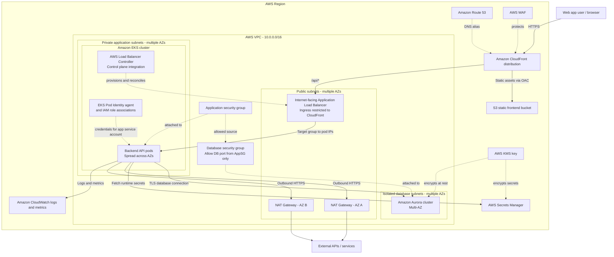

```mermaid

flowchart TB
    User[Web app user / browser]

    subgraph AWS[AWS Region]
        Route53[Amazon Route 53]
        WAF[AWS WAF]
        CloudFront[Amazon CloudFront distribution]
        Frontend[S3 static frontend bucket]
        Secrets[AWS Secrets Manager]
        CloudWatch[Amazon CloudWatch logs and metrics]
        KMS[AWS KMS key]

        subgraph VPC[AWS VPC - 10.0.0.0/16]
            subgraph Public[Public subnets - multiple AZs]
                ALB[Internet-facing Application Load Balancer<br/>Ingress restricted to CloudFront]
                NAT_A[NAT Gateway - AZ A]
                NAT_B[NAT Gateway - AZ B]
            end

            subgraph Private[Private application subnets - multiple AZs]
                subgraph EKS[Amazon EKS cluster]
                    LBC[AWS Load Balancer Controller<br/>Control plane integration]
                    AppPods[Backend API pods<br/>Spread across AZs]
                    PodIdentity[EKS Pod Identity agent<br/>and IAM role associations]
                end
            end

            subgraph Isolated[Isolated database subnets - multiple AZs]
                Aurora[Amazon Aurora cluster<br/>Multi-AZ]
            end

            AppSG[Application security group]
            DBSG[Database security group<br/>Allow DB port from AppSG only]
        end
    end

    External[External APIs / services]

    %% DNS resolves the app hostname to CloudFront; WAF is associated with the distribution.
    User -->|HTTPS| CloudFront
    Route53 -. DNS alias .-> CloudFront
    WAF -. protects .-> CloudFront

    %% CloudFront routes by path; OAC prevents public access to the S3 origin.
    CloudFront -->|Static assets via OAC| Frontend
    CloudFront -->|/api/*| ALB

    %% The controller provisions/configures the ALB; it is not in the request data path.
    ALB -->|Target group to pod IPs| AppPods
    LBC -. provisions and reconciles .-> ALB

    %% App data access and AWS identity/configuration.
    AppPods -->|TLS database connection| Aurora
    AppSG -. attached to .-> AppPods
    DBSG -. attached to .-> Aurora
    AppSG -. allowed source .-> DBSG
    PodIdentity -. credentials for app service account .-> AppPods
    AppPods -->|Fetch runtime secrets| Secrets

    %% Encryption is a service configuration, not a network request path.
    KMS -. encrypts at rest .-> Aurora
    KMS -. encrypts secrets .-> Secrets

    %% Egress uses the NAT gateway in each AZ; telemetry goes to CloudWatch.
    AppPods -->|Outbound HTTPS| NAT_A
    AppPods -->|Outbound HTTPS| NAT_B
    NAT_A --> External
    NAT_B --> External
    AppPods -->|Logs and metrics| CloudWatch
```
