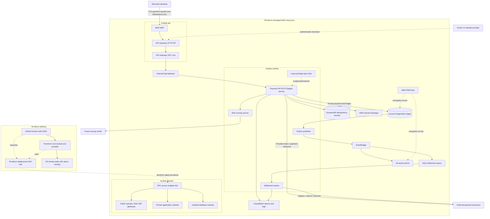

```mermaid
flowchart TB
    Merchant[Merchant backend]
    Identity[OAuth 2.0 identity provider]

    subgraph IaC[Terraform delivery]
        CI[GitHub Actions with OIDC]
        TF[Terraform root module and provider]
        Role[Terraform deployment IAM role]
        State[S3 remote state with native locking]
        CI --> TF
        CI -. assumes .-> Role
        TF --> State
        TF -. uses .-> Role
    end

    subgraph AWS[Terraform-managed AWS resources]
        subgraph ApiModule[module.api]
            WAF[AWS WAF]
            API[API Gateway HTTP API]
            Link[API Gateway VPC Link]
        end
        subgraph Network[module.network]
            VPC[VPC across multiple AZs]
            Public[Public subnets, IGW, NAT gateways]
            Private[Private application subnets]
            Data[Isolated database subnets]
            VPC --> Public
            VPC --> Private
            VPC --> Data
        end
        InternalLB[Internal load balancer]
        subgraph Runtime[module.runtime]
            Payments[Payment API ECS Fargate service]
            Risk[Risk scoring service]
            Outbox[Outbox publisher]
            Settlement[Settlement worker]
            TaskRoles[Least-privilege task roles]
        end
        Ledger[(Aurora PostgreSQL ledger)]
        Idempotency[(DynamoDB idempotency records)]
        Secrets[AWS Secrets Manager]
        Events[EventBridge]
        Queue[SQS settlement queue]
        Audit[S3 audit archive]
        KMS[AWS KMS keys]
        Monitor[CloudWatch alarms and logs]
    end

    RiskModel[Fraud scoring model]
    Provider[External payment processor]

    Merchant -->|TLS payment request and idempotency key| WAF
    WAF --> API
    Identity -. authenticates merchant .-> API
    API --> Link --> InternalLB --> Payments
    Payments --> Idempotency
    Payments -->|Persist payment and ledger entry| Ledger
    Payments --> Risk --> RiskModel
    Payments -->|Provider token / payment reference| Provider
    Ledger --> Outbox
    Outbox --> Events
    Events --> Queue --> Settlement
    Settlement -->|Capture / refund / reconcile| Provider
    Events --> Audit
    Payments --> Secrets
    KMS -. encryption at rest .-> Ledger
    KMS -. encryption at rest .-> Audit
    TaskRoles -. scoped permissions .-> Payments
    Payments --> Monitor
    Settlement --> Monitor
    Role -. terraform apply provisions .-> VPC


```
